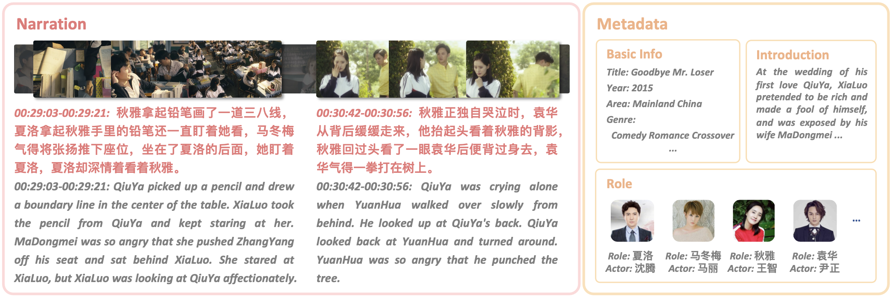

<div>
  <h2 align="center">
    🎬 Movie101 Benchmark
  </h2>
</div>

<p align="center">
    <a >
       
  	</a>
    <a >
       
  	</a>
    <a >
       
  	</a>
    <a >
       
  	</a>
    <br />
</p>



> [Chinese README](README.md)

Explore Movie101 in our paper [Movie101: A New Movie Understanding Benchmark](https://arxiv.org/abs/2305.12140). We also provide a [Chinese version](assets/Movie101_zh.pdf) of the paper for Chinese readers.  

This repository contains the Movie101 `dataset`, `baseline model codes`, and `evaluation scripts`. **More details can be found in the subfolders within this repository.** 

**Movie101 is a large-scale benchmark for AI Chinese movie understanding**, encompassing 101 movies. We collect the movies from the barrier-free channel on the [Xigua Video](https://www.ixigua.com/channel/barrier_free) platform, where standard movies are remastered with audio descriptions (ADs). Through automatic processes and manual correction, we obtain the ADs and actor lines from the raw videos. We also crawl rich meta information relevant to the movies. Eventually, Movie101 comprises 30,174 narration clips, totaling 92 hours.

The Movie101 benchmark includes two tasks: *Movie Clip Narrating (MCN)* and *Temporal Narration Grounding (TNG)*. 

- The MCN task requires the model to generate narration text based on movie videos to describe the current plot. In real-life movie narration, there are no timestamps to tell the model where to generate the narration. Therefore, to closely align with real-world application scenarios, MCN requires the model to generate narration when no actor is speaking. For this purpose, we reorganize the Movie101 dataset, merging the scattered narration clips between two dialogues into a longer clip, yielding a total of 14,109 long clips. Furthermore, to better evaluate the quality of model-generated narrations, we also designed a new metric specific to movie narrating, namely MNScore (Movie Narration Score).
- The TNG task requires the model to locate the start and end times of target clips in the movie based on a text description.

<!-- For both tasks, we demonstrate the performance of several existing baseline models and our new baselines provided in the paper. -->

We hope that our proposed Movie101 benchmark can inspire more explorations into narrating and understanding movies.

If you find Movie101 helpful, please consider citing our paper:

```
@inproceedings{yue-etal-2023-movie101,
    title = "Movie101: A New Movie Understanding Benchmark",
    author={Zihao Yue and Qi Zhang and Anwen Hu and Liang Zhang and Ziheng Wang and Qin Jin},
    booktitle = "Proceedings of the 61st Annual Meeting of the Association for Computational Linguistics (Volume 1: Long Papers)",
    year = "2023",
    url = "https://aclanthology.org/2023.acl-long.257",
    doi = "10.18653/v1/2023.acl-long.257",
    pages = "4669--4684",
}
```

```
@misc{yue2024movie101v2,
      title={Movie101v2: Improved Movie Narration Benchmark}, 
      author={Zihao Yue and Yepeng Zhang and Ziheng Wang and Qin Jin},
      year={2024},
      eprint={2404.13370},
      archivePrefix={arXiv},
      primaryClass={cs.CV}
}
```

For questions about the EMNLP 2022 Findings paper [MovieUN: A Dataset for Movie Understanding and Narrating](https://aclanthology.org/2022.findings-emnlp.135/), please see our [FAQ: MovieUN](assets/FAQ_MovieUN/FAQ_MovieUN.md).