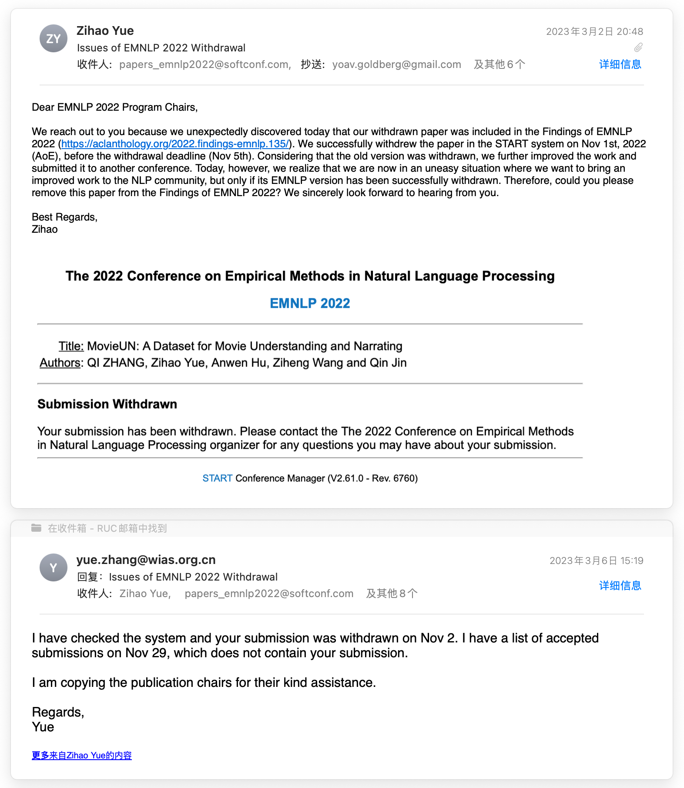
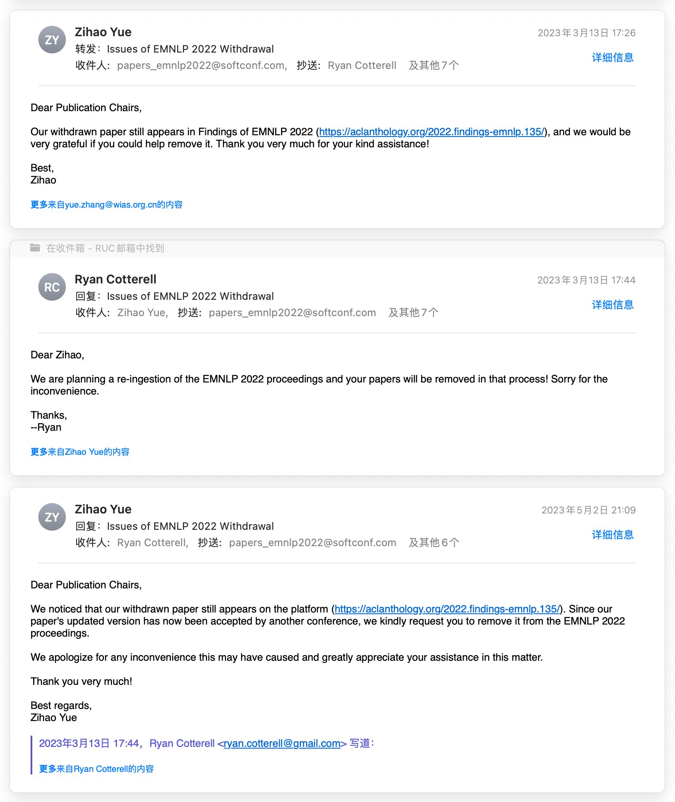
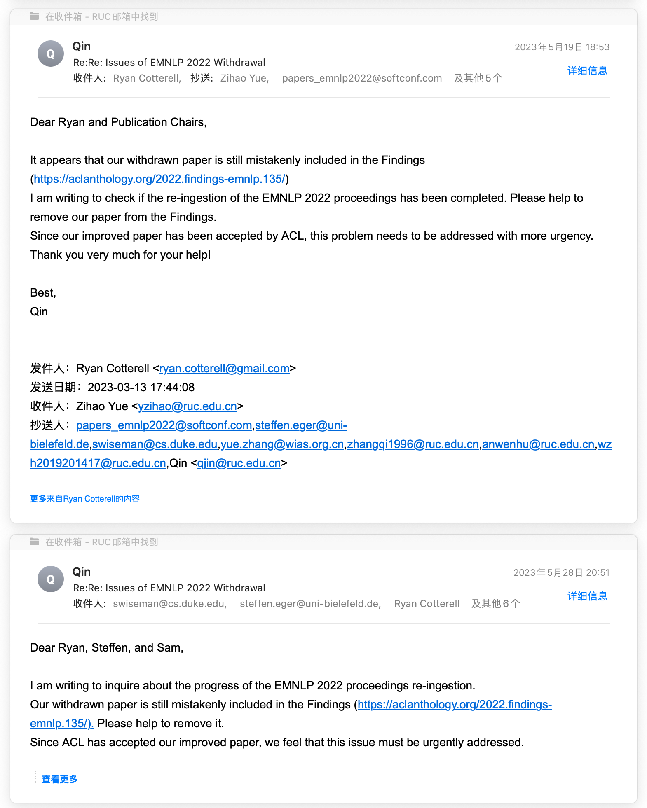

# FAQ

## What is the difference between MovieUN and Movie101?

**TLDR: Our work, MovieUN, which was withdrawn after being accepted by EMNLP 2022 Findings, was inadvertently made public due to a procedural error at EMNLP. Movie101 is our improved new work based on MovieUN, which has been accepted by ACL 2023.**

After MovieUN was accepted by EMNLP 2022 Findings on October 6, 2022, we withdrew it from the submission system on November 2, 2022 (before the withdrawal deadline), made improvements, and resubmitted it to ACL in January 2023 as Movie101. However, due to a procedural error at EMNLP, the successfully withdrawn work was mistakenly included in the proceedings. We discovered this issue in March 2023, and have been communicating with the EMNLP Program Committee since then. They are currently removing MovieUN and revising the new proceedings. The following are the email records of communications with the EMNLP 2022 Program Chairs and Publication Chairs:

Lastly, we are pleased to introduce the significant improvements made in Movie101 based on MovieUN. We redesigned two tasks - Movie Clip Narrating (MCN) and Temporal Narration Grounding (TNG) - and improved the evaluation methods to better meet the needs of practical application scenarios. For example, TNG requires locating target clips from the entire movie (not just a 200-second movie clip as in MovieUN) based on the narration text. The new work, Movie101, is more practical and challenging. We look forward to it promoting further explorations in AI movie understanding.