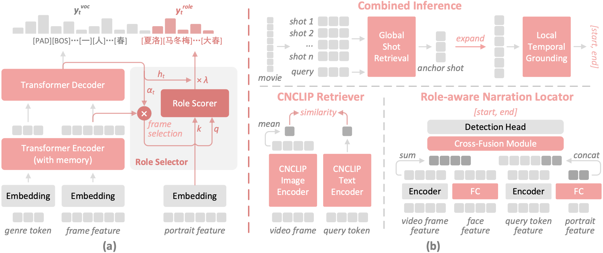

# Movie101 Baselines

该目录包含Movie101基准的官方基线代码，包括用于电影片段解说（MCN）任务的RMN模型和用于时序解说定位任务的CNCLIP+RNL框架。

## Movie Clip Narrating (MCN)

对于这个任务我们提供了论文中的RMN模型的代码（在`./RMN`)。它基于[OVP](https:/github.com/syuqings/video-paragraph)模型，并额外加入了genre的编码和用于生成角色名的指针网络。论文中的其它两个基线模型分别为[Vanilla Transformer](https://github.com/jayleicn/recurrent-transformer)和[OVP](https:/github.com/syuqings/video-paragraph)。

Model | EMScore | BERTScore | RoleF1 | MNScore
--|--|--|--|--
VT | 0.153 | 0.150 | 0 | 12.55
OVP | 0.155 | 0.159 | 0 | 13.18
RMN | 0.154 | 0.188 | 0.238 | 19.07

## Temporal Narration Grounding (TNG)

对于这个任务我们提供了论文中的CNCLIP+RNL框架的代码（在`./CNCLIP+RNL`)。它先将电影划分成等长20s片段，然后根据文本query检索回最相关的片段(Global Shot Retrieval)，然后该片段被扩充至200s，使用RNL模型在扩充后的片段中进行精确定位(Local Temporal Grounding)。检索模型使用的是微调过的[CNCLIP](https://github.com/OFA-Sys/Chinese-CLIP)，而RNL模型基于[IA-Net](https://github.com/liudaizong/IA-Net)。对于Local Temporal Grounding，论文中的额外的基线模型是[2D-TAN](https://github.com/chenjoya/2dtan)。

Model | Rank@1, IoU0.3 | Rank@1, IoU0.5 | Rank@5, IoU0.3 | Rank@5, IoU0.5
--|--|--|--|--
2D-TAN | 28.85 | 18.60 | 52.17 | 43.82
IA-Net | 25.16 | 17.98 | 57.11 | 42.68
RNL | 27.54 | 20.22 | 59.52 | 45.69
