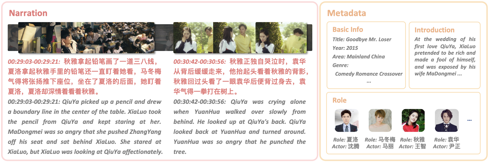

# Movie101 Dataset

The Movie101 dataset comprises videos of 101 movies (scraped from [Xigua Video](https://www.ixigua.com/channel/barrier_free)), along with timestamped narration text (obtained via ASR and and manually corrected) and actor lines (obtained via OCR). 

In line with the requirements for the Movie Clip Narrating (MCN) and Temporal Narration Grounding (TNG) tasks, we have constructed two variants: 
- Movie101-N, which includes paragraph narrations (narrations between two actors' dialogues are merged into paragraphs) for the narrating task; 
- Movie101-G for the grounding task.

## Movie101-raw

### annotation

- lines.json  
Actor lines and their timestamps for each movie.

- narration_clips.json  
Unmerged narration text and timestamps, used for the grounding task.

- narration_paragraphs.json  
Merged narration text (based on actor dialogues) and timestamps, used for the narrating task.

- public_split.json  
The split of movie_ids into training, validation, and test sets.

- metadata.json  
Metadata for each movie, including categories, summaries, cast lists, etc.

### videos

Movies and URL list: `video_src.json`

We have attempted to provide a script for crawling videos from the original website, but the crawling process is highly complex and difficult to ensure convenience. Therefore, we have decided to follow the [LSMDC Dataset](https://sites.google.com/site/describingmovies) to allow researchers to access the data directly from us by signing an agreement. If you need to access the videos in our dataset, please follow the steps below:

1. Click to download the [Agreement]()
2. Sign the Agreement (both the Chinese and English versions need to be signed);
3. Send an email to `yzihao@ruc.edu.cn` with the following information:
    - Your name, affiliation, and the name of your supervisor;
    - Attachment: Signed Agreement.

We will reply to your email as soon as possible (typically the same day) and provide instructions on how to access the data.

## Movie101-N & Movie101-G

These are the timestamped narration text for the pre-partitioned Movie101-N and Movie101-G. The scale of the data for each set is as follows:

| Dataset | Train | Val | Test |
|---------|-------|------------|------|
| Movie101-N | 11,325 | 1,416 | 1,368 |
| Movie101-G | 24,508 | 2,768 | 2,898 |